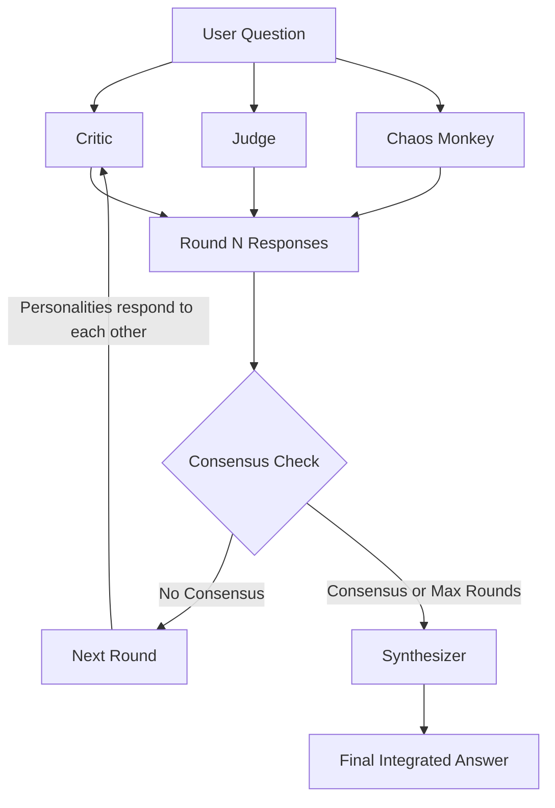

# Prizms

Multi-round debate LLM tool using LangGraph with multi-provider support. Prizms sends a question to multiple "personality" prompts for multi-round debate with real-time streaming output until consensus is reached.

## How It Works



Each personality brings a unique perspective to the debate. They respond to each other across rounds until consensus is reached or the maximum rounds limit is hit. A synthesizer then produces the final integrated answer.

## Prerequisites

- **Python 3.12+**
- **[uv](https://docs.astral.sh/uv/getting-started/installation/)** - Fast Python package manager (recommended)
- **One of the following LLM providers:**
  - [Ollama](https://ollama.com/download) - Easiest option for local LLMs
  - [LM Studio](https://lmstudio.ai/) - GUI-based local LLM application
  - [vLLM](https://docs.vllm.ai/en/latest/getting_started/installation.html) - High-performance inference server (requires GPU)

## Quick Start

### 1. Install uv

```bash
# macOS/Linux
curl -LsSf https://astral.sh/uv/install.sh | sh

# Windows
powershell -ExecutionPolicy ByPass -c "irm https://astral.sh/uv/install.ps1 | iex"
```

### 2. Clone and install

```bash
git clone https://github.com/your-org/prizms-oss.git
cd prizms-oss/backend
uv sync
```

### 3. Set up a provider

The easiest option is Ollama:

```bash
# Install Ollama from https://ollama.com/download, then:
ollama pull llama3
```

### 4. Configure

```bash
cp config.example.yaml config.yaml
# Edit config.yaml to match your provider and models
```

### 5. Run

```bash
uv run python main.py --config config.yaml "What is the meaning of life?"
```

## Documentation

See [backend/README.md](backend/README.md) for full documentation including:

- Configuration reference
- Provider setup guides (Ollama, vLLM, LM Studio)
- Personality customization
- Command-line options

## License

See repository root for license information.
