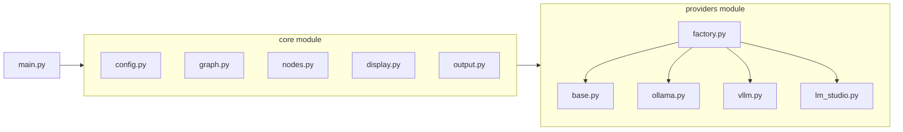

# Prizms Backend

Multi-round debate LLM tool using LangGraph with multi-provider support.

## Overview

Prizms sends a question to multiple "personality" prompts for multi-round debate with real-time streaming output. Personalities respond to each other across rounds until consensus is reached or the maximum rounds limit is hit. A designated synthesizer produces the final integrated perspective.

## Architecture



## Supported Providers

- **Ollama** - Local LLM server (default: `http://localhost:11434/v1`)
- **vLLM** - High-performance inference server (default: `http://localhost:8000/v1`)
- **LM Studio** - Local LLM GUI application (default: `http://localhost:1234/v1`)

All providers use OpenAI-compatible APIs, allowing seamless switching between them.

## Prerequisites

- **Python 3.12+**
- **[uv](https://docs.astral.sh/uv/getting-started/installation/)** - Fast Python package manager (recommended)
  ```bash
  # macOS/Linux
  curl -LsSf https://astral.sh/uv/install.sh | sh
  
  # Windows
  powershell -ExecutionPolicy ByPass -c "irm https://astral.sh/uv/install.ps1 | iex"
  ```

## Installation

```bash
cd backend
uv sync  # or pip install -e .
```

## Configuration

Prizms uses a LiteLLM-style YAML configuration file. Copy the example and customize:

```bash
cp config.example.yaml config.yaml
```

### Configuration Structure

```yaml
# Debate settings
debate_settings:
  output_dir: outputs
  max_rounds: 3
  consensus_prompt: consensus_check
  synthesizer_prompt: synthesizer

# LiteLLM-style model definitions
model_list:
  - model_name: ollama-llama3
    litellm_params:
      model: ollama/llama3
      api_base: http://localhost:11434/v1
      api_key: ""

  - model_name: vllm-mistral
    litellm_params:
      model: vllm/mistral-7b
      api_base: http://localhost:8000/v1

# Personality definitions
personalities:
  - name: critic
    prompt: prompts/critic.txt
    model_name: ollama-llama3

  - name: judge
    prompt: prompts/judge.txt
    model_name: vllm-mistral
```

### Model Definition

Models use the LiteLLM `provider/model_id` format:

| Provider | Format | Example |
|----------|--------|---------|
| Ollama | `ollama/<model>` | `ollama/llama3`, `ollama/llama3:70b` |
| vLLM | `vllm/<model>` | `vllm/mistral-7b`, `vllm/llama-2-13b` |
| LM Studio | `lm_studio/<model>` | `lm_studio/qwen3-4b` |

### Personality Definition

Each personality must be explicitly listed with:
- `name` - Unique identifier
- `prompt` - Path to the prompt file (relative to config file)
- `model_name` - References a model from `model_list`

System personalities (`consensus_check`, `synthesizer`) must also be defined.

## Usage

```bash
# Run with a question
uv run python main.py --config config.yaml "What is the meaning of life?"

# Run with question from file
uv run python main.py --config config.yaml -f question.txt

# Override max rounds
uv run python main.py --config config.yaml -r 5 "Your question here"
```

### Command-line Options

| Option | Description |
|--------|-------------|
| `--config` | Path to YAML config file (required) |
| `-f, --file` | Read question from a .txt or .md file |
| `-r, --max-rounds` | Override maximum debate rounds |

## Provider Setup

### Ollama

1. **Install Ollama:** Download from [ollama.com/download](https://ollama.com/download)
2. **Pull a model:** `ollama pull llama3`
3. **Verify it's running:** Ollama starts automatically as a background service on `localhost:11434`

> **Tip:** Ollama is the easiest provider to set up - just install and pull a model.

### vLLM

> **Note:** vLLM requires a CUDA-compatible GPU.

1. **Install vLLM:** See [vLLM Installation Guide](https://docs.vllm.ai/en/latest/getting_started/installation.html)
   ```bash
   pip install vllm
   ```
2. **Start the server:**
   ```bash
   python -m vllm.entrypoints.openai.api_server \
     --model mistralai/Mistral-7B-v0.1 \
     --port 8000
   ```

> **Tip:** For quick setup, use the official Docker image:
> ```bash
> docker run --gpus all -p 8000:8000 vllm/vllm-openai:latest --model mistralai/Mistral-7B-v0.1
> ```

### LM Studio

1. **Download LM Studio:** [lmstudio.ai](https://lmstudio.ai/)
2. **Load a model:** Use the Discover tab to download, then load in the Chat tab
3. **Start local server:** Go to the "Local Server" tab (left sidebar) and click "Start Server"

> **Tip:** The server runs on `localhost:1234` by default. Ensure the server is started before running Prizms.

## Output

Results are saved to the configured `output_dir`:

- `<personality>.cot.md` - Chain of thought (content within `<think>` tags)
- `<personality>.ans.md` - Final answer (content after `</think>` tag)

## Project Structure

```
backend/
├── main.py                 # Entry point
├── pyproject.toml          # Dependencies
├── config.example.yaml     # Example configuration
├── core/
│   ├── config.py           # YAML config parsing
│   ├── graph.py            # LangGraph state and flow
│   ├── nodes.py            # Graph node functions
│   ├── display.py          # Rich terminal UI
│   └── output.py           # File output
├── providers/
│   ├── base.py             # Abstract provider class
│   ├── factory.py          # Provider factory
│   ├── ollama.py           # Ollama provider
│   ├── vllm.py             # vLLM provider
│   └── lm_studio.py        # LM Studio provider
└── prompts/                # Default personality prompts
```

## License

See repository root for license information.
