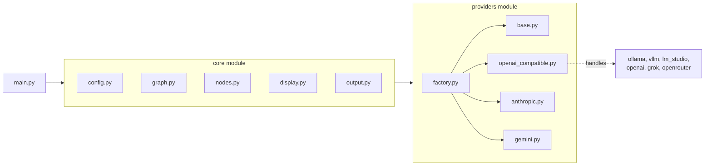
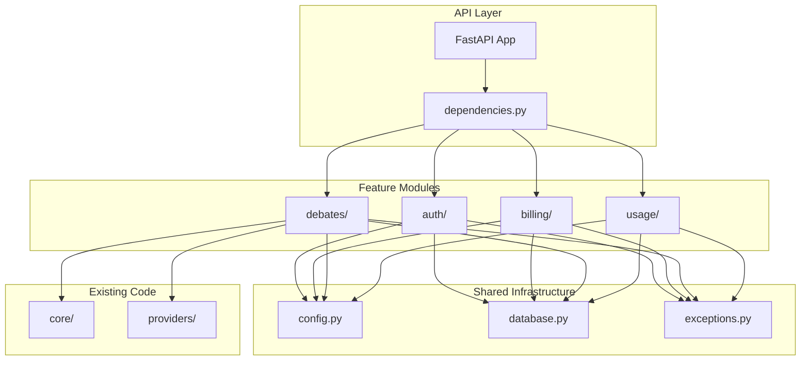

# Prizms Backend

Multi-round debate LLM tool using LangGraph with multi-provider support.

## Overview

Prizms sends a question to multiple "personality" prompts for multi-round debate with real-time streaming output. Personalities respond to each other across rounds until consensus is reached or the maximum rounds limit is hit. A designated synthesizer produces the final integrated perspective.

## Architecture



## Modular Architecture

The backend follows a **modular monolith** pattern - clean module boundaries with interface-based communication, designed for easy future microservices extraction if needed.

### Architecture Overview



### Layers

- **API Layer** (`api/`): FastAPI app composition and dependency injection
- **Feature Modules** (`modules/`): Self-contained business domains (auth, billing, debates, usage)
- **Shared Infrastructure** (`shared/`): Cross-cutting concerns (config, database, exceptions)
- **Existing Code** (`core/`, `providers/`): Debate engine and LLM providers

### Key Principles

1. Modules communicate only through interfaces (Protocol classes)
2. Each module owns its own models and business logic
3. Cross-module dependencies are injected via the ServiceContainer
4. Shared infrastructure is limited to truly cross-cutting concerns

## Supported Providers

### Local Providers

- **Ollama** - Local LLM server (default: `http://localhost:11434/v1`)
- **vLLM** - High-performance inference server (default: `http://localhost:8000/v1`)
- **LM Studio** - Local LLM GUI application (default: `http://localhost:1234/v1`)

### Cloud Providers

- **Anthropic** - Claude models via Anthropic API (requires API key)
- **OpenAI** - GPT models via OpenAI API (requires API key)
- **Google Gemini** - Gemini models via Google AI API (requires API key)
- **xAI Grok** - Grok models via xAI API (requires API key)
- **OpenRouter** - Unified access to 100+ models via OpenRouter API (requires API key)

Local providers use OpenAI-compatible APIs, allowing seamless switching between them. Cloud providers require API keys and incur usage charges.

## Prerequisites

- **Python 3.12+**
- **[uv](https://docs.astral.sh/uv/getting-started/installation/)** - Fast Python package manager (recommended)
  ```bash
  # macOS/Linux
  curl -LsSf https://astral.sh/uv/install.sh | sh
  
  # Windows
  powershell -ExecutionPolicy ByPass -c "irm https://astral.sh/uv/install.ps1 | iex"
  ```

## Installation

```bash
cd backend
uv sync  # or pip install -e .
```

## Configuration

Prizms uses a LiteLLM-style YAML configuration file. Copy the example and customize:

```bash
cp config.example.yaml config.yaml
```

### Configuration Structure

```yaml
# Debate settings
debate_settings:
  output_dir: outputs
  max_rounds: 3
  consensus_prompt: consensus_check
  synthesizer_prompt: synthesizer

# LiteLLM-style model definitions
model_list:
  - model_name: ollama-llama3
    litellm_params:
      model: ollama/llama3
      api_base: http://localhost:11434/v1
      api_key: ""

  - model_name: vllm-mistral
    litellm_params:
      model: vllm/mistral-7b
      api_base: http://localhost:8000/v1

# Personality definitions
personalities:
  - name: critic
    prompt: prompts/critic.txt
    model_name: ollama-llama3

  - name: judge
    prompt: prompts/judge.txt
    model_name: vllm-mistral
```

### Model Definition

Each model requires a `provider` field and the model identifier:

| Provider | Provider Field | Model ID Example |
|----------|----------------|------------------|
| Ollama | `ollama` | `llama3`, `llama3:70b` |
| vLLM | `vllm` | `mistralai/Mistral-7B-Instruct-v0.2` |
| LM Studio | `lm_studio` | `qwen/qwen3-4b` |
| Anthropic | `anthropic` | `claude-sonnet-4-20250514`, `claude-3-5-haiku-20241022` |
| OpenAI | `openai` | `gpt-4o`, `gpt-4o-mini`, `gpt-3.5-turbo` |
| Gemini | `gemini` | `gemini-2.0-flash`, `gemini-2.0-flash-lite`, `gemini-1.5-pro` |
| xAI Grok | `grok` | `grok-3`, `grok-3-mini` |
| OpenRouter | `openrouter` | `anthropic/claude-3-opus`, `openai/gpt-4-turbo`, `meta-llama/llama-3.1-70b-instruct` |

### Personality Definition

Each personality must be explicitly listed with:
- `name` - Unique identifier
- `prompt` - Path to the prompt file (relative to config file)
- `model_name` - References a model from `model_list`

System personalities (`consensus_check`, `synthesizer`) must also be defined.

## Usage

```bash
# Run with a question
uv run python main.py --config config.yaml "What is the meaning of life?"

# Run with question from file
uv run python main.py --config config.yaml -f question.txt

# Override max rounds
uv run python main.py --config config.yaml -r 5 "Your question here"
```

### Command-line Options

| Option | Description |
|--------|-------------|
| `--config` | Path to YAML config file (required) |
| `-f, --file` | Read question from a .txt or .md file |
| `-r, --max-rounds` | Override maximum debate rounds |

## Provider Setup

### Ollama

1. **Install Ollama:** Download from [ollama.com/download](https://ollama.com/download)
2. **Pull a model:** `ollama pull llama3`
3. **Verify it's running:** Ollama starts automatically as a background service on `localhost:11434`

> **Tip:** Ollama is the easiest provider to set up - just install and pull a model.

### vLLM

> **Note:** vLLM requires a CUDA-compatible GPU.

1. **Install vLLM:** See [vLLM Installation Guide](https://docs.vllm.ai/en/latest/getting_started/installation.html)
   ```bash
   pip install vllm
   ```
2. **Start the server:**
   ```bash
   python -m vllm.entrypoints.openai.api_server \
     --model mistralai/Mistral-7B-v0.1 \
     --port 8000
   ```

> **Tip:** For quick setup, use the official Docker image:
> ```bash
> docker run --gpus all -p 8000:8000 vllm/vllm-openai:latest --model mistralai/Mistral-7B-v0.1
> ```

### LM Studio

1. **Download LM Studio:** [lmstudio.ai](https://lmstudio.ai/)
2. **Load a model:** Use the Discover tab to download, then load in the Chat tab
3. **Start local server:** Go to the "Local Server" tab (left sidebar) and click "Start Server"

> **Tip:** The server runs on `localhost:1234` by default. Ensure the server is started before running Prizms.

### Anthropic Claude

> **Note:** Anthropic is a cloud provider. Requires internet connection, API key, and usage charges apply.

1. **Get API Key:** Sign up at [console.anthropic.com](https://console.anthropic.com)
2. **Set Environment Variable:**
   ```bash
   export ANTHROPIC_API_KEY=sk-ant-...
   ```
3. **Configure in config.yaml:**
   ```yaml
   model_list:
     - model_name: claude-sonnet
       litellm_params:
         provider: anthropic
         model: claude-sonnet-4-20250514
         api_key: ${ANTHROPIC_API_KEY}
   ```

**Available Models:**
| Model | Description |
|-------|-------------|
| `claude-sonnet-4-20250514` | Balanced speed and capability |
| `claude-opus-4-20250514` | Most capable, slower |
| `claude-3-5-haiku-20241022` | Fastest, most economical |

> **Tip:** Use environment variables for API keys rather than hardcoding them in config files.

### OpenAI GPT

> **Note:** OpenAI is a cloud provider. Requires internet connection, API key, and usage charges apply.

1. **Get API Key:** Sign up at [platform.openai.com](https://platform.openai.com)
2. **Set Environment Variable:**
   ```bash
   export OPENAI_API_KEY=sk-...
   ```
3. **Configure in config.yaml:**
   ```yaml
   model_list:
     - model_name: gpt-4o
       litellm_params:
         provider: openai
         model: gpt-4o
         api_key: ${OPENAI_API_KEY}
   ```

**Available Models:**
| Model | Description |
|-------|-------------|
| `gpt-4o` | Latest multimodal model, recommended |
| `gpt-4o-mini` | Faster, more economical |
| `gpt-4-turbo` | Previous generation, still capable |
| `gpt-3.5-turbo` | Fastest, most economical |

> **Tip:** Use environment variables for API keys rather than hardcoding them in config files.

### Google Gemini

> **Note:** Google Gemini is a cloud provider. Requires internet connection, API key, and usage charges apply.

1. **Get API Key:** Sign up at [Google AI Studio](https://aistudio.google.com/app/apikey)
2. **Set Environment Variable:**
   ```bash
   export GOOGLE_API_KEY=AI...
   ```
3. **Configure in config.yaml:**
   ```yaml
   model_list:
     - model_name: gemini-2.0-flash
       litellm_params:
         provider: gemini
         model: gemini-2.0-flash
         api_key: ${GOOGLE_API_KEY}
   ```

**Available Models:**
| Model | Description |
|-------|-------------|
| `gemini-2.0-flash` | Fast and efficient, recommended |
| `gemini-2.0-flash-lite` | Fastest, most economical |
| `gemini-1.5-pro` | Previous generation, most capable |

> **Tip:** Use environment variables for API keys rather than hardcoding them in config files.

### xAI Grok

> **Note:** xAI Grok is a cloud provider. Requires internet connection, API key, and usage charges apply.

1. **Get API Key:** Sign up at [console.x.ai](https://console.x.ai)
2. **Set Environment Variable:**
   ```bash
   export XAI_API_KEY=xai-...
   ```
3. **Configure in config.yaml:**
   ```yaml
   model_list:
     - model_name: grok-3
       litellm_params:
         provider: grok
         model: grok-3
         api_key: ${XAI_API_KEY}
   ```

**Available Models:**
| Model | Description |
|-------|-------------|
| `grok-3` | Latest Grok 3 model, recommended |
| `grok-3-mini` | Smaller, faster Grok 3 model |

> **Tip:** Use environment variables for API keys rather than hardcoding them in config files.

### OpenRouter (Unified Access)

> **Note:** OpenRouter is a cloud provider. Requires internet connection, API key, and usage charges apply.

OpenRouter provides unified access to 100+ models from various providers through a single API.

1. **Get API Key:** Sign up at [openrouter.ai](https://openrouter.ai)
2. **Set Environment Variable:**
   ```bash
   export OPENROUTER_API_KEY=sk-or-...
   ```
3. **Configure in config.yaml:**
   ```yaml
   model_list:
     - model_name: claude-via-openrouter
       litellm_params:
         provider: openrouter
         model: anthropic/claude-3-opus
         api_key: ${OPENROUTER_API_KEY}
   ```

**Popular Models via OpenRouter:**
| Model | Description |
|-------|-------------|
| `anthropic/claude-3-opus` | Claude 3 Opus |
| `anthropic/claude-3.5-sonnet` | Claude 3.5 Sonnet |
| `openai/gpt-4-turbo` | GPT-4 Turbo |
| `openai/gpt-4o` | GPT-4o |
| `meta-llama/llama-3.1-70b-instruct` | Llama 3.1 70B |
| `mistralai/mistral-large` | Mistral Large |
| `google/gemini-pro-1.5` | Gemini Pro 1.5 |

See [openrouter.ai/models](https://openrouter.ai/models) for the full list.

> **Tip:** Use environment variables for API keys rather than hardcoding them in config files.

## Testing

### Run Unit Tests Only

Unit tests run without any API keys and use mocking:

```bash
uv run pytest -v
```

### Run All Tests (Including Integration)

Integration tests require API keys to verify real API connectivity. Create a `test-keys.env` file with your API keys:

```bash
# test-keys.env (do not commit to version control)
ANTHROPIC_API_KEY=sk-ant-...
OPENAI_API_KEY=sk-...
GOOGLE_API_KEY=AI...
XAI_API_KEY=xai-...
OPENROUTER_API_KEY=sk-or-...

# Supabase (for database integration tests)
SUPABASE_URL=https://your-project.supabase.co
SUPABASE_SERVICE_ROLE_KEY=eyJhbGciOiJIUzI1NiIsInR5cCI6IkpXVCJ9...
```

**Getting Supabase Credentials:**
1. Create a project at [supabase.com](https://supabase.com)
2. Go to **Project Settings** → **API**
3. Copy the **Project URL** → `SUPABASE_URL`
4. Copy the **service_role** key (under "Project API keys") → `SUPABASE_SERVICE_ROLE_KEY`

> **Warning:** The service_role key bypasses Row Level Security. Never expose it in client-side code.

Then run all tests with the keys loaded:

```bash
# Load keys and run all tests
source test-keys.env && uv run pytest -v
```

Integration tests are automatically skipped if their corresponding API key/credential is not set.

### Run Specific Provider Tests

```bash
# Test OpenAI-compatible providers (ollama, vllm, lm_studio, openai, grok, openrouter)
uv run pytest tests/providers/test_openai_compatible.py -v

# Test Anthropic provider
uv run pytest tests/providers/test_anthropic.py -v

# Run only integration tests (requires API keys)
source test-keys.env && uv run pytest -k "Integration" -v
```

## Output

Results are saved to the configured `output_dir`:

- `<personality>.cot.md` - Chain of thought (content within `<think>` tags)
- `<personality>.ans.md` - Final answer (content after `</think>` tag)

## Project Structure

```
backend/
├── main.py                 # Entry point
├── pyproject.toml          # Dependencies
├── config.example.yaml     # Example configuration
├── api/                    # FastAPI application layer
│   ├── __init__.py
│   └── dependencies.py     # Dependency injection setup
├── modules/                # Feature modules (modular monolith)
│   ├── auth/               # Authentication module
│   ├── billing/            # Billing & credits module
│   ├── debates/            # Debate orchestration module
│   └── usage/              # Usage tracking module
├── shared/                 # Shared infrastructure
│   ├── config.py           # Pydantic settings (env vars)
│   ├── database.py         # Supabase client factory
│   └── exceptions.py       # Base exception classes
├── core/                   # Debate engine
│   ├── config.py           # YAML config parsing
│   ├── graph.py            # LangGraph state and flow
│   ├── nodes.py            # Graph node functions
│   ├── display.py          # Rich terminal UI
│   └── output.py           # File output
├── providers/              # LLM providers
│   ├── base.py             # Abstract provider class + ModelConfig
│   ├── factory.py          # Provider factory
│   ├── openai_compatible.py  # Unified provider for OpenAI-compatible APIs
│   │                         # (ollama, vllm, lm_studio, openai, grok, openrouter)
│   ├── anthropic.py        # Anthropic Claude provider (native client)
│   └── gemini.py           # Google Gemini provider (native client)
└── prompts/                # Default personality prompts
```

## License

See repository root for license information.
