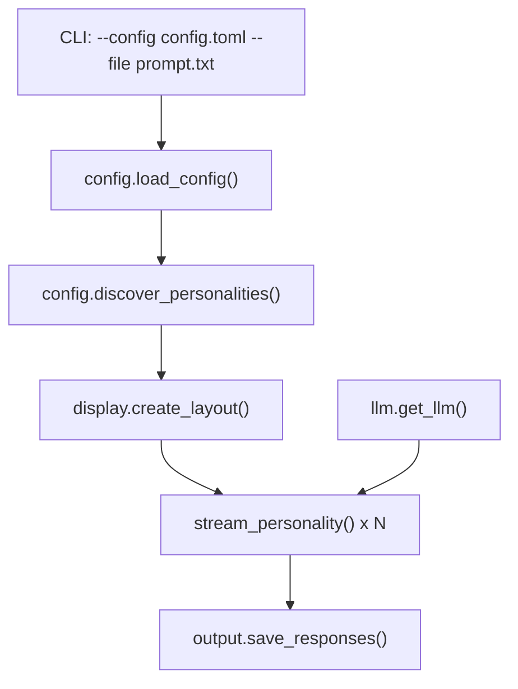

# LangChain Evaluation

LangChain implementation of the prizms multi-perspective LLM tool.

## Project Structure

```
langchain/
  config.py             # Configuration loading and personality discovery
  display.py            # Rich terminal UI components
  llm.py                # LLM client factory
  output.py             # Response parsing and file output
  main.py               # CLI entry point and orchestration
  config.example.toml   # Example configuration file
  pyproject.toml        # Project dependencies
  prompts/              # Personality prompt files (*.txt)
  outputs/              # Generated response files (*.cot.md, *.ans.md)
```

## Architecture

### Data Flow



### Streaming Multi-Column Display

The tool sends your question to multiple LLM "personalities" in parallel using async streaming. Each personality has its own system prompt stored in the personalities directory (default: `prompts/`), making them easy to refine independently.

Using Rich's `Layout` and `Live` components, responses stream in real-time across side-by-side terminal panels:

```
┌─────────────────┬─────────────────┬─────────────────┐
│     Judge       │  Chaos Monkey   │     Critic      │
├─────────────────┼─────────────────┼─────────────────┤
│ <think>         │ <think>         │ <think>         │
│ Analyzing...    │ What if...      │ Let me examine  │
│ ...streaming... │ ...streaming... │ ...streaming... │
└─────────────────┴─────────────────┴─────────────────┘
```

The layout dynamically adjusts to the number of personality files found in the configured directory.

### Output File Separation

Responses are split into chain-of-thought (COT) and answer files:

- **Chain of Thought** (`*.cot.md`): Content within `<think>...</think>` tags showing the model's reasoning process
- **Answer** (`*.ans.md`): The final response after removing the thinking block

The `langchain-openai` package connects to LM Studio using the OpenAI-compatible API, so no special local LLM package is needed. Everything runs locally with no external accounts required.

## Dependencies

All packages are MIT licensed and require no accounts or API keys:

| Package | Purpose |
|---------|---------|
| `langchain` | Main orchestration framework |
| `langchain-core` | Core abstractions (chains, prompts, output parsers) |
| `langchain-openai` | OpenAI-compatible API (works with LM Studio) |
| `langchain-community` | Community integrations and tools |
| `langgraph` | Graph-based agent workflows |
| `langchain-text-splitters` | Text chunking utilities |
| `rich` | Terminal UI with multi-column streaming display |

## Setup

### Prerequisites

1. [LM Studio](https://lmstudio.ai/) installed and running with local server on port 1234
2. Model loaded: `qwen/qwen3-4b-thinking-2507`
3. Python 3.12+
4. [UV](https://docs.astral.sh/uv/) package manager

### Installation

```bash
# Install dependencies
uv sync

# Copy environment template
cp .env.example .env
```

### Environment Configuration

Edit `.env` if your LM Studio runs on a different port:

```
OPENAI_API_BASE=http://localhost:1234/v1
OPENAI_API_KEY=not-needed
```

## Configuration

### Using a Config File

You can specify custom directories for personalities and output using a TOML config file:

```bash
uv run python main.py --config path/to/config.toml "Your question here"
```

### Config File Format

Create a TOML file (see `config.example.toml`):

```toml
# Directory containing personality prompt files (*.txt)
personalities_dir = "prompts"

# Directory where output files will be saved
output_dir = "outputs"
```

Paths in the config file are resolved relative to the config file's location.

### Default Behavior

If no `--config` is provided, the tool uses:
- `prompts/` directory (relative to script) for personality files
- `outputs/` directory (relative to script) for output files

## Running

```bash
# With default configuration
uv run python main.py "Your question here"

# With custom config file
uv run python main.py --config my-config.toml "Your question here"

# With question from a file (.txt or .md)
uv run python main.py --file prompt.txt
uv run python main.py -f prompt.md

# Combine with custom config
uv run python main.py --config my-config.toml --file prompt.md
```

## Output

Responses are saved to the configured output directory with separate files for chain-of-thought and answers. For each personality file (e.g., `judge.txt`), two output files are created:

| File Pattern | Description |
|--------------|-------------|
| `{personality}.cot.md` | The personality's reasoning process |
| `{personality}.ans.md` | The personality's final answer |
