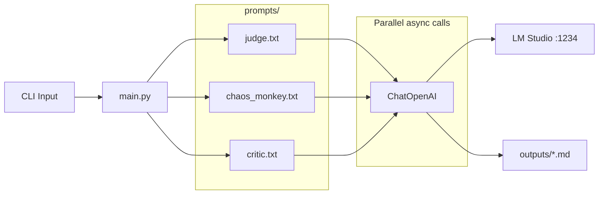

# LangChain Evaluation

LangChain implementation of the prizms multi-perspective LLM tool.

## Architecture



The tool sends your question to three LLM "personalities" in parallel using async calls. Each personality has its own system prompt stored in the `prompts/` directory, making them easy to refine independently.

The `langchain-openai` package connects to LM Studio using the OpenAI-compatible API, so no special local LLM package is needed. Everything runs locally with no external accounts required.

## Dependencies

All packages are MIT licensed and require no accounts or API keys:

| Package | Purpose |
|---------|---------|
| `langchain` | Main orchestration framework |
| `langchain-core` | Core abstractions (chains, prompts, output parsers) |
| `langchain-openai` | OpenAI-compatible API (works with LM Studio) |
| `langchain-community` | Community integrations and tools |
| `langgraph` | Graph-based agent workflows |
| `langchain-text-splitters` | Text chunking utilities |

## Setup

### Prerequisites

1. [LM Studio](https://lmstudio.ai/) installed and running with local server on port 1234
2. Model loaded: `qwen/qwen3-4b-thinking-2507`
3. Python 3.12+
4. [UV](https://docs.astral.sh/uv/) package manager

### Installation

```bash
# Install dependencies
uv sync

# Copy environment template
cp .env.example .env
```

### Environment Configuration

Edit `.env` if your LM Studio runs on a different port:

```
OPENAI_API_BASE=http://localhost:1234/v1
OPENAI_API_KEY=not-needed
```

## Running

```bash
uv run python main.py "Your question here"
```

## Output

Responses are saved to the `outputs/` directory:
- `judge.md`
- `chaos_monkey.md`
- `critic.md`
