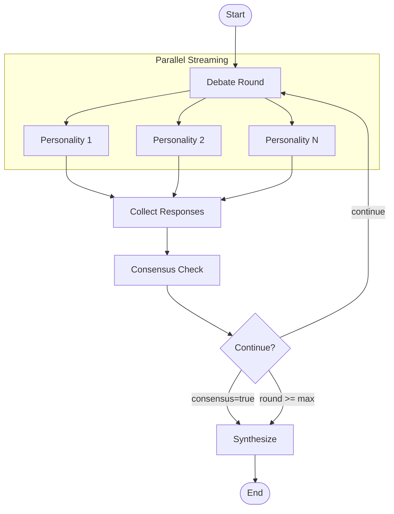

# LangGraph Evaluation

LangGraph implementation of the prizms multi-round debate LLM tool.

This is a fork of the [LangChain implementation](../langchain/) that adds multi-round debate capabilities using LangGraph's state graph.

## Key Differences from LangChain Version

| Feature | LangChain | LangGraph |
|---------|-----------|-----------|
| Execution | Single parallel fan-out | Multi-round debate graph |
| Interaction | Personalities respond independently | Personalities respond to each other |
| Termination | Single round | Consensus-based or max rounds |
| Output | Individual perspectives | Synthesized final perspective |

## Project Structure

```
langgraph/
  graph.py              # LangGraph state and graph definition
  nodes.py              # Node functions (debate_round, check_consensus, synthesize)
  config.py             # Configuration with max_rounds, consensus_prompt, synthesizer_prompt
  display.py            # Rich terminal UI with round labels
  llm.py                # LLM client factory
  output.py             # Response parsing and file output
  main.py               # CLI entry point using compiled graph
  config.example.toml   # Example configuration file
  pyproject.toml        # Project dependencies
  prompts/              # Personality and system prompt files
    chaos_monkey.txt    # Anxiety/risk perspective
    critic.txt          # Critical analysis perspective
    judge.txt           # Balanced assessment perspective
    consensus_check.txt # Neutral consensus detection prompt
    synthesizer.txt     # Dedicated rational synthesizer (not a debate participant)
  outputs/              # Generated response files
```

## Architecture

### State Schema

```python
class DebateState(TypedDict):
    question: str
    personalities: list[str]           # Dynamic list of N personalities
    max_rounds: int                    # Safety limit
    current_round: int                 # Counter
    rounds: list[dict[str, str]]       # History of all rounds
    consensus_reached: bool
    consensus_prompt: str              # Name of consensus check prompt file
    synthesizer_prompt: str            # Name of synthesizer prompt file
    final_synthesis: str | None
```

### Graph Flow



### Multi-Round Debate

Each round, all personalities respond in parallel with streaming display:

```
Round 1
┌─────────────────┬─────────────────┬─────────────────┐
│     Judge       │  Chaos Monkey   │     Critic      │
├─────────────────┼─────────────────┼─────────────────┤
│ ...streaming... │ ...streaming... │ ...streaming... │
└─────────────────┴─────────────────┴─────────────────┘

Round 2
┌─────────────────┬─────────────────┬─────────────────┐
│     Judge       │  Chaos Monkey   │     Critic      │
├─────────────────┼─────────────────┼─────────────────┤
│ (responding to  │ (responding to  │ (responding to  │
│  round 1...)    │  round 1...)    │  round 1...)    │
└─────────────────┴─────────────────┴─────────────────┘
```

In rounds 2+, each personality sees the previous round's responses and can react to them.

### Consensus Detection

After each round (starting from round 2), a neutral LLM call analyzes whether the personalities have reached substantial agreement. The debate continues until:
- Consensus is reached, or
- Max rounds limit is hit

### Synthesis

Once debate concludes, a dedicated synthesizer (not a debate participant) produces a final integrated perspective. The synthesizer is a rational, dispassionate voice that:
- Does NOT participate in debate rounds
- Reviews all perspectives objectively
- Produces a balanced, actionable conclusion

### Collapsible UI

The terminal display uses a web-chat-like pattern:
1. **During streaming**: Live content shown in multi-column panels
2. **After round completes**: Compact summary with character counts
3. **Answers displayed prominently**: Extracted content after `</think>` tags shown clearly

## Dependencies

All packages are MIT licensed and require no accounts or API keys:

| Package | Purpose |
|---------|---------|
| `langchain` | Base framework |
| `langchain-core` | Core abstractions |
| `langchain-openai` | OpenAI-compatible API (works with LM Studio) |
| `langgraph` | Graph-based state machine for multi-round debate |
| `rich` | Terminal UI with streaming display |

## Setup

### Prerequisites

1. [LM Studio](https://lmstudio.ai/) installed and running with local server on port 1234
2. Model loaded: `qwen/qwen3-4b-thinking-2507`
3. Python 3.12+
4. [UV](https://docs.astral.sh/uv/) package manager

### Installation

```bash
# Install dependencies
uv sync

# Copy environment template
cp .env.example .env
```

## Configuration

### Config File Format

Create a TOML file (see `config.example.toml`):

```toml
# Directory containing personality prompt files (*.txt)
personalities_dir = "prompts"

# Directory where output files will be saved
output_dir = "outputs"

# Maximum debate rounds before forcing synthesis
max_rounds = 3

# Prompt file for consensus detection (excluded from personalities)
consensus_prompt = "consensus_check"

# Prompt file for final synthesis (excluded from personalities)
# A dedicated, neutral synthesizer that does not participate in debate rounds
synthesizer_prompt = "synthesizer"
```

## Running

```bash
# Basic usage with defaults
uv run python main.py "Your question here"

# Specify max rounds
uv run python main.py "Your question" --max-rounds 5

# Short form
uv run python main.py "Your question" -r 5

# With question from file
uv run python main.py --file prompt.txt

# With custom config
uv run python main.py --config my-config.toml "Your question"
```

### CLI Options

| Option | Short | Description |
|--------|-------|-------------|
| `--file` | `-f` | Read question from .txt or .md file |
| `--config` | | Path to TOML config file |
| `--max-rounds` | `-r` | Maximum debate rounds |

## Output

Responses are saved to the configured output directory:

| File Pattern | Description |
|--------------|-------------|
| `{personality}.cot.md` | Chain of thought (last round) |
| `{personality}.ans.md` | Final answer (last round) |
| `synthesizer.cot.md` | Synthesis reasoning |
| `synthesizer.ans.md` | Final synthesized answer |

## Comparison with LangChain Version

Run the original single-round version:
```bash
cd ../langchain
uv run python main.py "Your question"
```

Run the multi-round debate version:
```bash
cd ../langgraph
uv run python main.py "Your question"
```

The LangGraph version will show multiple rounds of debate before producing a synthesized output.
